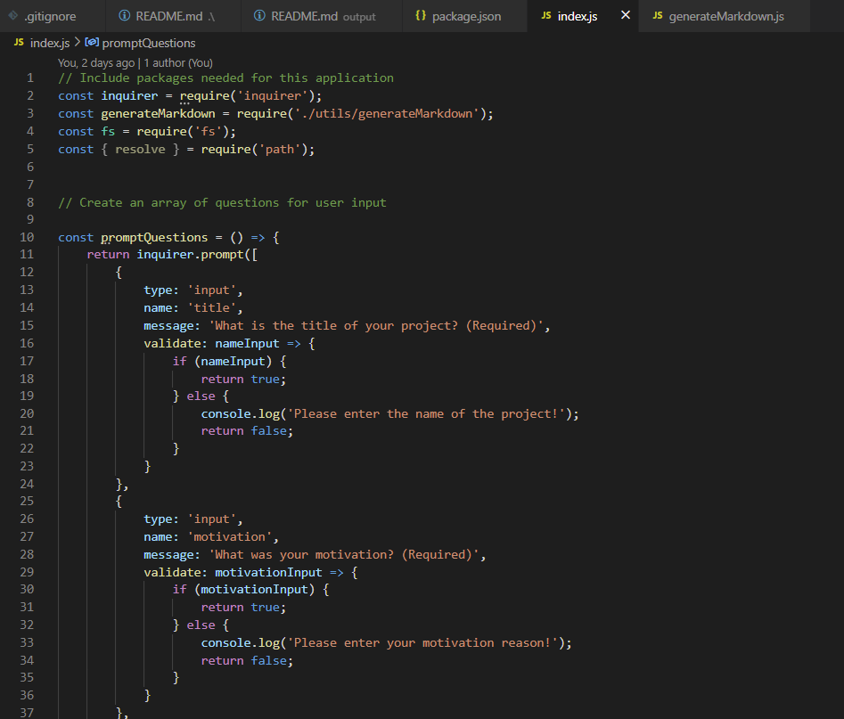

# zpl-professional-README-generator-1

## Description
  
  - What was my motivation? I wanted to make a README generator that will allow me to save time in the future creating README's for future projects.
  - Why did I build this project? I wanted to save time on making README files.
  - What problem does it solve? It solves the problem of constantly making brand new README files for every project.
  - What did I learn? I learned how to use Node.js and inquirer to generate README files.
  - What makes my project stand out? It has all of the necessary pieces for a professional README file.
  
  
  ## Table of Contents (Optional)
  
  - [Description](#description)
  - [Credits](#credits)
  - [License](#license)
  - [Features](#features)

  ## Installation

  What are the steps required to install your project? Provide a step-by-step description of how to get the development environment running.

  ## Usage

  
  
  [Demonstration Video](https://youtu.be/5Pgi11IvSnk)
  
  ## Credits

  List your collaborators, if any, with links to their GitHub profiles.

  If you used any third-party assets that require attention, list the creators with links to their primary web presence in this section.

  If you followed tutorials, include links to those here as well.

  ## License

  No license.

  ---

  ## Features
  
  If your project has a lot of features, list them here.

  ## How to Contribute

  If you created an application or package and would like other developers to contribute it, you can include guidelines for how to do so. The [Contributor Covenant](https://www.contributor-covenant.org/) is an industry standard, but you can always write your own if you'd prefer.

  ## Tests

  Go the extra mile and write tests for your application. Then provide examples on how to run them here.

  ## Questions?
  If you have any questions, check out my [GitHub profile](https://github.com/zachary-levin) at or email me at [zlevin706@gmail.com](mailto:zlevin706@gmail.com)
